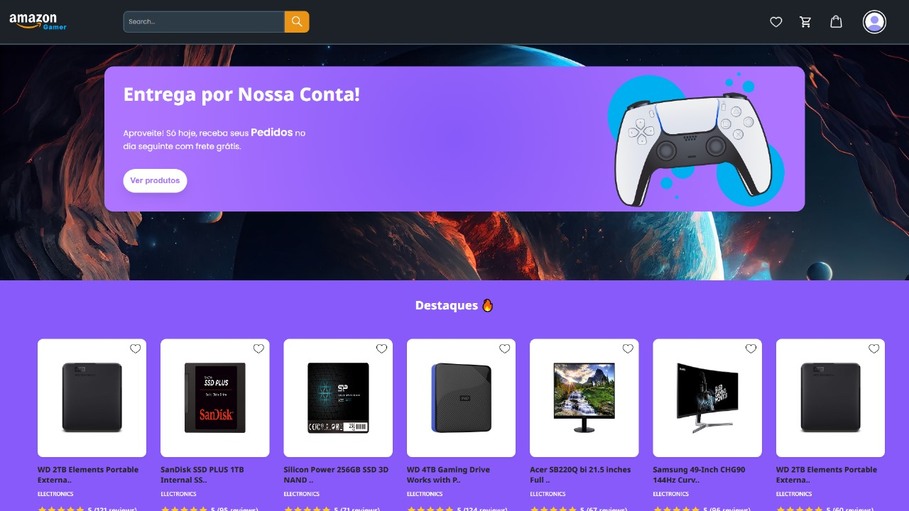
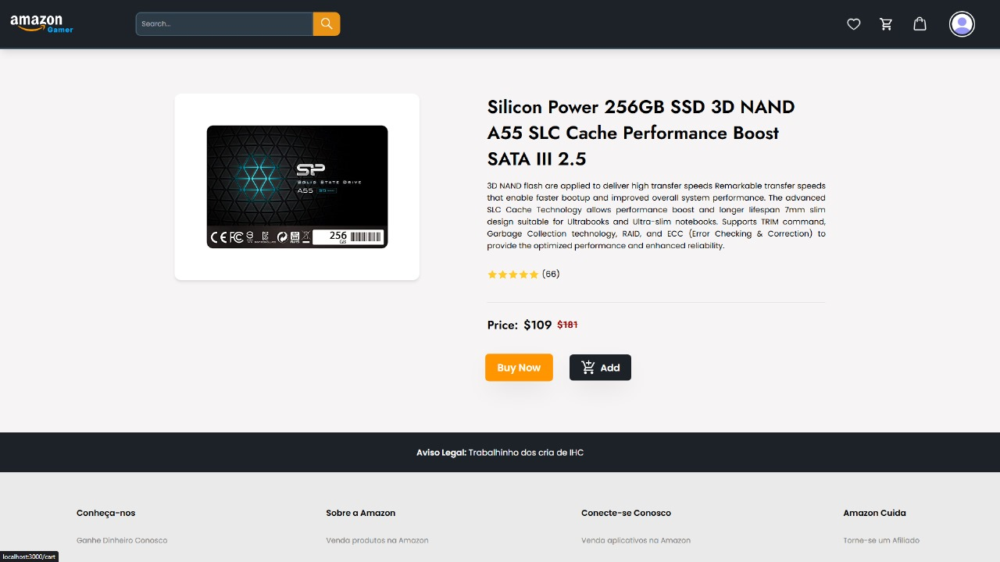
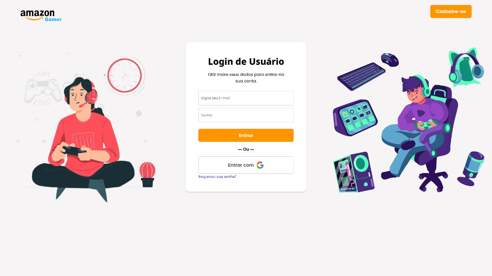
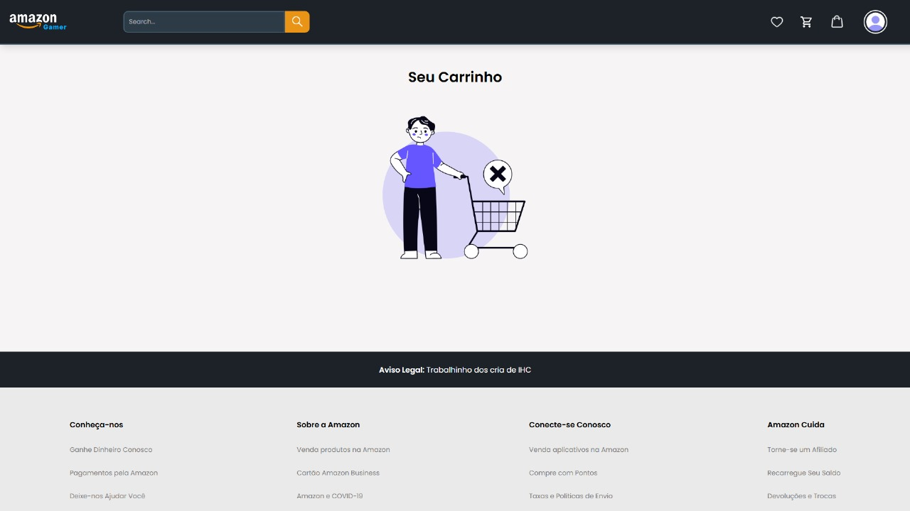

# Plataforma Amazon Games

## Descrição

A Plataforma Amazon Games é uma aplicação web desenvolvida para redesenhar uma versão temática da Amazon, focada exclusivamente no público gamer, oferecendo uma experiência visual e funcional adaptada a esse nicho. Enquanto a Amazon atual é funcional, sua abordagem genérica não atende de forma otimizada públicos específicos. Este projeto, alinhado aos princípios da disciplina de Interação Humano-Computador (IHC), propõe uma interface imersiva, moderna e segmentada, projetada para entusiastas de jogos, com um catálogo de produtos fictícios, autenticação de usuários e uma experiência de navegação otimizada para o universo gamer. A plataforma utiliza uma API de produtos fictícios, integra autenticação e armazenamento de dados via Firebase e é hospedada via GitHub Pages para acesso público e testes.

## Público-Alvo

O público-alvo da Plataforma Amazon Games abrange pessoas na faixa etária de 10 a 30 anos com interesse em jogos eletrônicos, hardware, acessórios e cultura gamer. Este grupo valoriza:
- **Praticidade**: Navegação intuitiva e acesso rápido a produtos.
- **Comparação entre Produtos**: Ferramentas para avaliar opções de jogos, hardware e acessórios.
- **Estética Imersiva**: Design visual moderno e temático, inspirado em plataformas como Twitch e Steam.
- **Navegação Rápida**: Interface fluida e responsiva para uma experiência eficiente.

## Fundamentação Teórica

O desenvolvimento da Plataforma Amazon Games é fundamentado em conceitos de Interação Humano-Computador (IHC) e experiência do usuário (UX). A Amazon, embora eficiente, adota uma abordagem generalista, o que pode diluir a experiência para nichos específicos, como o público gamer. De acordo com Nielsen (1994), os princípios de usabilidade, como eficiência, consistência e feedback claro, são essenciais para interfaces intuitivas, especialmente para públicos com expectativas específicas de rapidez e imersão. A cultura gamer, influenciada por plataformas como Twitch e Steam, demanda designs dinâmicos, com cores vibrantes, elementos temáticos e interatividade, conceitos aplicados para criar uma experiência envolvente. Além disso, a segmentação de mercado, conforme Kotler e Keller (2016), embasa a personalização para o público de 10 a 30 anos, que busca praticidade e identificação visual.

## Funcionalidades

- **Exploração de Produtos**: Visualização de um catálogo fictício de jogos, hardware e acessórios, obtido via API, com detalhes como nome, preço e descrição.
- **Autenticação de Usuários**: Sistema de login e registro seguro, implementado com Firebase.
- **Gerenciamento de Conta**: Armazenamento e consulta de dados de login dos usuários em um banco de dados simples no Firebase.
- **Interface Responsiva**: Design adaptável para desktops, tablets e smartphones, com estética imersiva inspirada no universo gamer.
- **Identidade Visual**: Mantém elementos da identidade da Amazon, combinados com referências visuais do universo gamer, inspiradas em plataformas como Twitch e Steam.
- **Hospedagem Online**: Disponibilização da plataforma via GitHub Pages para acesso público e testes.

## Tecnologias Utilizadas

- **HTML**: Linguagem de marcação para estruturar o conteúdo, como seções de produtos e cabeçalhos temáticos.
- **CSS**: Estilização visual para criar uma interface moderna, responsiva e alinhada à estética gamer.
- **JavaScript**: Adiciona interatividade, como manipulação dinâmica de produtos e integração com APIs.
- **React**: Framework JavaScript para construir uma interface componentizada, modular e eficiente.
- **Firebase**: Plataforma do Google para autenticação de usuários (Firebase Authentication) e armazenamento de dados de login em um banco de dados em tempo real ou Firestore.
- **FakeStore API**: API pública que fornece dados fictícios de produtos, permitindo simular um catálogo de jogos, hardware e acessórios.
- **GitHub Pages**: Serviço de hospedagem para publicar a plataforma online, tornando-a acessível via URL pública de forma simples e gratuita.

## Requisitos

- Navegador web  (Chrome, Firefox, Edge, etc.)
- Conexão à internet 
- Node.js e npm/nvm (para desenvolvimento local e instalação de dependências)

## Como Utilizar

1. **Acesse a Plataforma**:
   - Abra o navegador e vá para a URL hospedada no GitHub Pages ou `https://ihc-trabalho-final.vercel.app/` (se local).

2. **Registro e Login**:
   - Crie uma conta e faça login usando e-mail e senha.

3. **Exploração de Produtos**:
   - Navegue pelo catálogo fictício de jogos, hardware e acessórios.
   - Visualize detalhes como nome, preço e descrição em uma interface temática e imersiva.

4. **Gerenciamento de Conta**:
   - Após o login, os dados da conta são salvos e podem ser consultados via Firebase.

5. **Adicione produtos e efetue uma compra**:
   - Clique no icone de carrinho de comprar e efetue sua comprar ficticia.

## Adaptações

Durante o desenvolvimento da nossa Plataforma Amazon Games, algumas adaptações foram necessárias em comparação aos espoço incial do projeto, feito durante a primeira parte atraves do FIGMA, devido a desafios enfrentados:
   - Comparativo de Produtos: O escopo inicial previa uma funcionalidade de comparação de produtos, semelhante à do site Zoom, permitindo que os usuários avaliassem dois ou mais itens (jogos, hardware, acessórios) lado a lado. Infelizmente, devido a limitações de tempo e complexidade técnica, não foi possível implementar essa função, que permanece como uma meta para futuras iterações.
   - Limitação de Produtos: Enfrentamos dificuldades para expandir o catálogo de produtos com temática gamer, pois a FakeStore API oferece variedade limitada e não possui itens suficientemente alinhados ao universo de jogos eletrônicos, hardware e acessórios.

## Screenshots

- **Página Inicial**: 
- **Tela do Produto**: 
- **Tela de Login**: 
- **Carrinho de Compras**: 

## Autores

- Bruno Ricardo Cavalcante Gomes
- Davi Lima de Andrade
- Gabriel Canuto e Alencar
- Luigi Gomes Amaral Presta
- Rafael Pires Bastos Nunes
- Kleverton Filipe de Alcântara Romeiro Leite

## Referências
- Nielsen, J. (1994). "Usability Engineering." Morgan Kaufmann Publishers, San Francisco, CA.
- Kotler, P., & Keller, K. L. (2016). "Marketing Management" (15th ed.). Pearson Education, Upper Saddle River, NJ.

## Licença

Este projeto é de uso interno e demonstrativo. Entre em contato com os autores para permissões de uso ou modificação.
